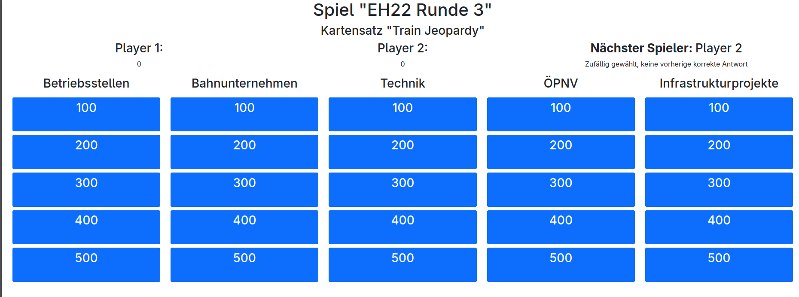

# djangopardy
A work-in-progress implementation of jeopardy in django.

## Run using Docker

1. Clone the repository (or just the docker-compose.yml)
2. Create a "djangopardy.cfg" file in the root directory with the content from "djangopardy.cfg.example" adjusted to your needs (especially the secret key)
3. Run `docker-compose up` to start the server
4. Create a superuser: `docker compose exec -it djangopardy python src/manage.py createsuperuser`
5. Open the admin interface at `http://localhost:8040/admin` and log in with the superuser credentials and create a game etc.

## Database Model/Games
In Jeopardy, "answers" are given, and "questions" are the "answers" of the game. This is reflected in the database model - don't be confused!

- There are Cardsets for a "topic" (e.g. "Train Jeopardy")
- Each Cardset has a number of points available (in every category)
- Each Cardset has a number of categories (more than in one round possible)
- There are Answer with Questions. Each one has exactly one category and point, as well as options for media (WIP)
- Each Cardset has multiple gamerounds
- Each gameround has a number of players
- Each gameround has a predefined set of categories
- The answers of each gameround are chosen semi-random with each reload of the gamefield (first random unused question of given category and point, if all were used the answer with the oldest last occurence)
- asked answeres are saved in "AnswerQuestionsAsked", with Players who named the "correct" question, "wrong" question, or "open" (no player named a question)
- The scoreboard is computed by iterating over AnswerQuestionsAsked and adding the points to the players score
- The next player to choose category & points is also computed by looking at AnswerQuestionsAsked (or using a random player if no one had the correct question)

## Not supported yet
- Double Jeopardy
- Hardware (light/button) interaction

